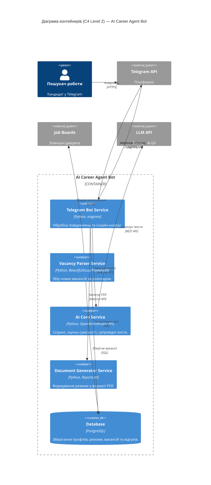

```mermaid
C4Container
  title Діаграма контейнерів (C4 Level 2) — AI Career Agent Bot

  Person(user, "Пошукач роботи", "Кандидат у Telegram")

  Container_Boundary(bot_system, "AI Career Agent Bot") {
      Container(bot, "Telegram Bot Service", "Python, aiogram", "Обробка повідомлень та інлайн-кнопок.")
      Container(parser, "Vacancy Parser Service", "Python, BeautifulSoup/Playwright", "Збір нових вакансій за розкладом.")
      Container(ai_core, "AI Core Service", "Python, OpenAI/Anthropic API", "Скіринг, оцінка сумісності, супровідні листи.")
      Container(doc_gen, "Document Generator Service", "Python, ReportLab", "Формування резюме у форматі PDF.")
      ContainerDb(db, "Database", "PostgreSQL", "Зберігання профілів, резюме, вакансій та відгуків.")
  }

  System_Ext(telegram, "Telegram API", "Платформа")
  System_Ext(job_boards, "Job Boards", "Зовнішні джерела")
  System_Ext(llm_api, "LLM API", "Зовнішній ШІ")

  Rel(user, telegram, "Комунікує", "HTTPS")
  Rel(telegram, bot, "Webhook / Polling", "HTTPS")
  Rel(bot, db, "Читає/пише дані", "SQL")
  Rel(bot, ai_core, "Запитує аналіз", "Internal API")
  Rel(bot, doc_gen, "Запитує PDF", "Internal API")
  Rel(parser, job_boards, "Збирає оголошення", "HTTP")
  Rel(parser, db, "Зберігає вакансії", "SQL")
  Rel(ai_core, llm_api, "Аналізує тексти", "REST API")
  Rel(bot, telegram, "Надсилає відповіді", "Telegram API")
```
