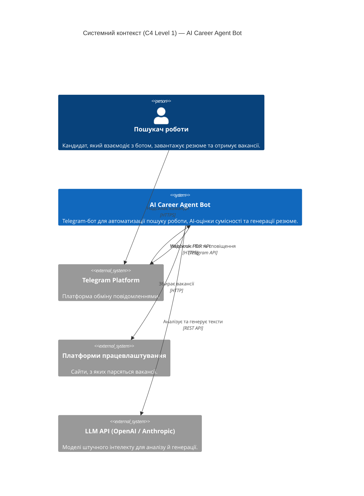

```mermaid
C4Context
  title Системний контекст (C4 Level 1) — AI Career Agent Bot

  Person(user, "Пошукач роботи", "Кандидат, який взаємодіє з ботом, завантажує резюме та отримує вакансії.")
  System(bot, "AI Career Agent Bot", "Telegram-бот для автоматизації пошуку роботи, AI-оцінки сумісності та генерації резюме.")

  System_Ext(telegram, "Telegram Platform", "Платформа обміну повідомленнями.")
  System_Ext(job_boards, "Платформи працевлаштування", "Сайти, з яких парсяться вакансії.")
  System_Ext(llm_api, "LLM API (OpenAI / Anthropic)", "Моделі штучного інтелекту для аналізу й генерації.")

  Rel(user, telegram, "Надсилає команди", "HTTPS")
  Rel(telegram, bot, "Webhook / Bot API", "HTTPS")
  Rel(bot, telegram, "Надсилає PDF та сповіщення", "Telegram API")
  Rel(bot, job_boards, "Збирає вакансії", "HTTP")
  Rel(bot, llm_api, "Аналізує та генерує тексти", "REST API")
```
