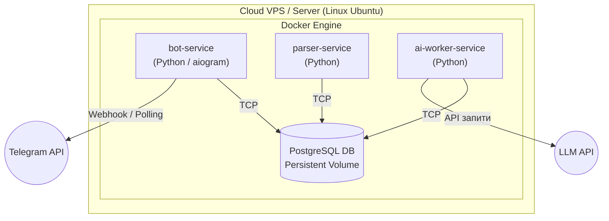

```mermaid
graph TD
  subgraph Cloud ["Cloud VPS / Server (Linux Ubuntu)"]
    subgraph Docker ["Docker Engine"]
        bot_c["bot-service<br/>(Python / aiogram)"]
        parser_c["parser-service<br/>(Python)"]
        ai_c["ai-worker-service<br/>(Python)"]
        db_c[(PostgreSQL DB<br/>Persistent Volume)]
    end
  end

  telegram(("Telegram API"))
  llm(("LLM API"))

  bot_c -->|Webhook / Polling| telegram
  ai_c -->|API запити| llm
  bot_c -->|TCP| db_c
  parser_c -->|TCP| db_c
  ai_c -->|TCP| db_c
```
